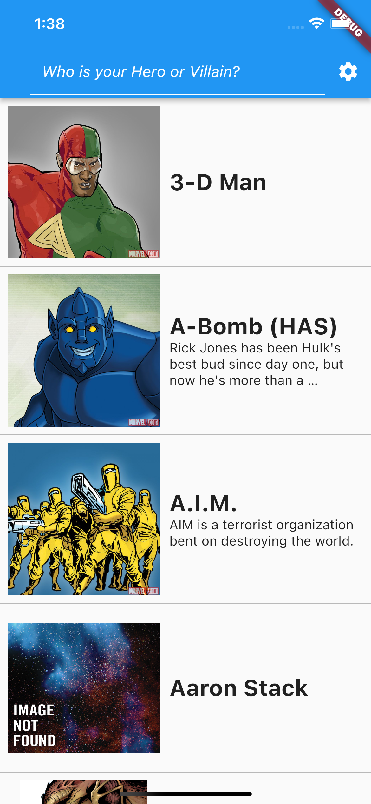
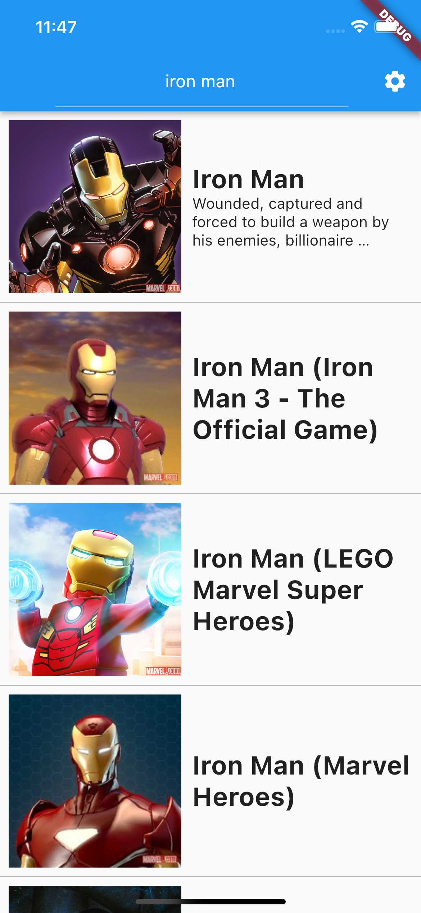
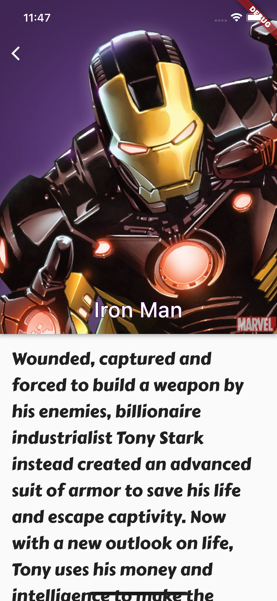

# App for Marvel Fan

It shows the Marvel Heros and Villains with Offical Marvel API.

| main | search | detail |
| :-:|:-:|:-:|
||||


## Tech Stack

Frameworks

- Flutter

```shell
% flutter doctor
Doctor summary (to see all details, run flutter doctor -v):
[✓] Flutter (Channel stable, 2.5.1, on macOS 11.5.2 20G95 darwin-x64, locale ja-JP)
[✓] Android toolchain - develop for Android devices (Android SDK version 29.0.2)
[✓] Xcode - develop for iOS and macOS
[✓] Chrome - develop for the web
[✓] Android Studio (version 4.1)
[✓] VS Code (version 1.44.2)
[✓] Connected device (2 available)

• No issues found!
```

State

- main:
	- Redux Saga
- sub
	- Provier
	- flutter_hooks

DB

- [Moor](https://moor.simonbinder.eu/)

Routing

- [routemaster](https://pub.dev/packages/routemaster)

## Getting Started

### API key


- [Marvel Developer Portal](https://developer.marvel.com/)


```dart
/// lib/api/api_key.dart
class MarvelDev{
  static const  publicKey = "aaaa";
  static const  privateKey = "bbbb";
}

```
