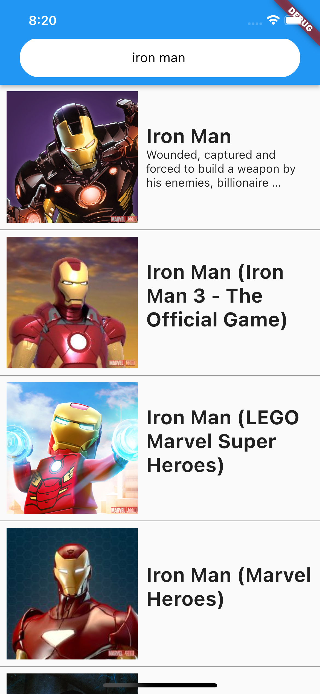

# Marvel App

It is a Flutter App with Marvel API.

## Getting Started



### API key


- [Marvel Developer Portal](https://developer.marvel.com/)


```dart
/// lib/api/api_key.dart
class MarvelDev{
  static const  publicKey = "aaaa";
  static const  privateKey = "bbbb";
}

```
